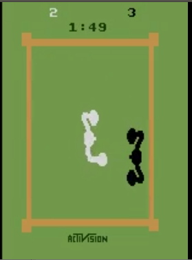
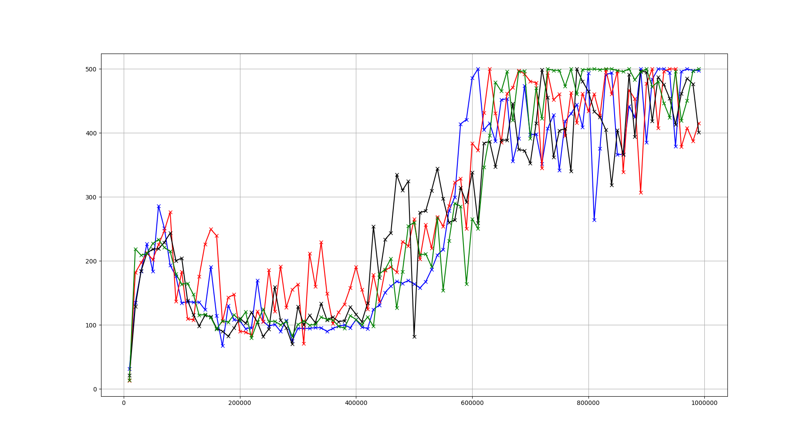

# DT+NN 实验报告

> 最近使用cartpole 和 Boxing两个环境做了一些实验，发现了一些问题，目前看来还要继续改进。
>

## 实验通用设置说明

- 本次实验按照按照迭代次数确定测试采样频率。测试采样周期=总的迭代次数/设置的测试的点的个数。 我的所有实验的测试的点的个数都是100个
- 进入测试阶段之后，我会使用当前训练好的网络去跑当前的环境，固定完成40轮episode，求每一个episode的reward和，之后取40轮的平均值，作为当前的迭代次数的测试结果。

## Boxing 环境下的实验

Boxing是我一开始使用的环境，因为我觉得他的环境大小适中，比较适合我的机器规模。

### Boxing 环境介绍

- Boxing 游戏是两个火柴人拳击的游戏。

- 我是用的是Boxing-ram-v4，observation一共有128个特征，是一个一维特征，不是像素信息。actions一共有6个。

- 我对环境进行了一定的预处理：

  - observation归一化成0~1之间。
  - reward转化成0，-1，1三种标准数字，避免极端值影响

- 使用的超参数：

  - 迭代次数：进行300w次训练

  - 网络结构：

    - q-value-network 使用 [372,64]的多层感知机
    - 学习速率 $2.5× 10^{-4}$
    - 使用double Q learning (由 baseline封装好的)
    - $\gamma=0.99$
    - 网络每4次迭代进行一次训练
    - 每5000次迭代进行一次更新

  - 探索概率：使用线性变化的探索概率，从1.0开始，在十分之一的迭代（也就是20w次）的时候，下降到0.01

  - replay buffer 设置：

    - 使用Prioritized experience replay buffer 进行训练（实现采用了baseline的实现）

      

    - 其中，$\alpha=0.6$

    - $\epsilon=10^{-6}$, 这个参数在算法中没体现，是用在更新权重的时候，为了避免p为0设置的正数，也就是对应12行代码，改成$p_j=|\delta_j|+\epsilon$

    - $\beta$根据迭代次数动态调整，第一次迭代从0.4开始，最后一次迭代时为1.0

### 实验结果

#### 1. Baselines的结果

 

其中蓝色的线是使用prioritized replay buffer 进行实验的结果，一共实验了5次，虚线是极值，实线是平均值。

而黑色是是用普通的replay buffer实验一次实验的结果，发现明显的差距，所以之后在这个环境下，我都是用prioritized replay buffer进行实验

#### 2. 进行全分布测试算法准确度(也就是加上了决策树算法，但是训练数据分布到所有的节点)

在这之后我进行了一定时间的bug调试，这个是我在认为我的算法没问题之后的最后几次实验的结果，几条曲线的含义如下：

- 蓝色的曲线是上一次实验的baseline算法的实验图像

- 红色，黄色，粉色，黑色4条线是进行全分布的结果：

  - 黑色线是认定我的代码没有问题后的第一次全分布实验：发现和baseline有一定的差距，我个人认为可能是prioritized replay buffer 进行重复的样本权重的更新的结果，具体理由如下：

    - 每个节点训练完成后都会进行一次权重的更新，也就是说有n个节点，在一次训练中，权重会被**更新**n次，而prioritized 权重是被**覆盖**n次。
    - 因为求$\max p_i$的过程使用的是当前最大的$p_i$ 和新得到的$p_i$ 进行比较，取较大值，而$p_i$由样本的TD error决定，
    - 在重复更新n次的过程中，就导致我在求$\max p_i$的时候得到了比实际结果更大的结果，而样本的真正的权重只是被覆盖了n次。

  - 第一次进行了黄线的实验：参数与前面一致，但是更新时，只在更新编号为0的节点时，进行权重的更新，在150w的时候已经得到了和baseline一致的效果，提前手动终止。

  - 第二次进行了红线的实验：方案是记录一次训练过程中已经被训练过的样本编号，**只有样本编号在当前训练过程中没有被更新过的时候，在进行权重的更新**，训练结果没有baseline好。

  - 第三次进行了紫线的实验：第二次实验结果让我非常困惑，因为在全分布条件下，**第二次实验的效果应该是和第一次实验的效果等价的**，于是我进行了第三次实验，使用和第一次实验相同的方案进行3次重复实验，发现**没办法复现黄线的结果**。**我现在没办法确定黄线的结果到底是概率问题，还是我使用git版本回退的时候有遗漏导致实验结果不一致。**

- 绿色线的实验：第三次实验的结果让我非常困惑，但是我现在没有解决，我跳过了这个问题，强行尝试了真正进行样本分发时的决策树算法的实验：

  - 我使用了2层树的深度，也就是4个叶子节点，使用红线的重复样本只更新一次的方案进行实验，发现效果不是特别好。

### Boxing 下的实验结论

1. 由于一次Boxing的训练的时间成本较高，并且我无法确定prioritized replay buffer到底有没有影响，希望使用普通的ER避免这个因素的干扰，但是普通的ER在当前的实验环境下没法很好的训练，**基于这两个因素，我决定暂时放弃Boxing这类128特征的实验环境**，接下来的时间我决定用CartPole进行实验。
2. 假设prioritized replay buffer 没有问题，那么为什么训练效果会和baseline差了一小节？这个问题我现在没有一个特别好的思路。
3. 并且，那条没法复现黄线也让我非常疑惑，真的是概率问题么？

## CartPole 环境下的实验

### CartPole 环境介绍

- 游戏要求玩家控制左右两个方向，让平衡木保持更久的平衡

- 我使用CartPole-v1，

  - 这个环境有4个observation，取值范围是：

    ​	env.observation_space.low = [ -4.80000000e+00,  -3.40282347e+38,  -4.18879020e-01,-3.40282347e+38]

    ​	env.observation_space.high = [  4.80000000e+00,   3.40282347e+38,   4.18879020e-01,3.40282347e+38]

  - action 有两个

  - reward ，直到判定游戏结束前，reward恒为1，并且，**该实验的单个episode的reward的上限是500**

- 使用的超参数：

  - 迭代次数：进行100w次~250w训练
  - 网络结构：
    - q-value-network 使用 [128, 32] 和 [64] 两种多层感知机
    - 学习速率 $2.5× 10^{-4}$
    - 使用double Q learning (由 baseline封装好的)
    - $\gamma=0.99$
    - 网络没4次迭代进行一次训练
    - 每5000次迭代进行一次更新
  - 探索概率：使用线性变化的探索概率，从1.0开始，在十分之一的迭代（也就是20w次）的时候，下降到0.01
  - replay buffer 设置：
    - **使用普通的replay buffer 进行采样。**

### 实验结果

#### 1. 和baseline的比较

##### 实验

- 蓝色线是直接使用baseline的算法
- 红色线是使用dt+nn的算法，但是数据分布到所有的节点，dt深度为4，也就是有16个节点
- 黑色线是使用dt+nn的算法，但是数据分布到所有的节点，dt深度为3，也就是有8个节点
- 绿色线是使用dt+nn的算法，关闭了数据分布到所有节点的功能，但是dt深度为0，也就是只有1个节点

##### 结论

- 可以看到，几个算法拥有相近的性能，**大抵侧面证明我的代码应该没什么问题**。

#### 2. 相同参数不同实验的方差

##### 实验

这个环境和前面的Boxing相比，有一个劣势，就是每次训练的结果差异性较大：

- 下面张图是baseline在100w次迭代条件下的三次实验结果：

- 下面这张图是使用dt+nn的算法，但是**数据分布到所有的节点**，dt深度为4，也就是有16个节点，一共进行了三次实验的每次实验数据：

##### 结论

- 可以看到，相同参数的不同实验，能看到比较大的差异，
- 这个环境的训练过程没有那么的稳定。
- 由于该环境**设置了500reward的单个episode的最大值**，所以到后期之后，会因此有所影响。

#### 3. 进行DT+NN的测试，以一层划分的节点个数为变量

##### 实验

- 第一个实验，一个划分2个节点，深度为1层，也就是一共只有两个节点

- 第二个实验，一个划分10个节点，深度为1层，一共只有两个节点：

- 第三个实验，一个划分15个节点，深度为1层，一共只有两个节点：

- 第四个实验，一个划分100个节点，深度为1层，一共只有两个节点：

  

- 综合几次实验，取各个实验平均值，整合成一张图：

​	图中，蓝色曲线为baselines，红色，绿色，黄色，黑色几条曲线分别是划分2个节点，10个节点，15个节点，100个节点的实验结果。

##### 结论

- 进行分布以后，出现了一个非常有趣的现象，相同环境下的不同次数的实验数据效果差异非常大，在第一次实验中，甚至出现了全程的测试数据都在10左右徘徊的结果（这个数据基本上就是我们使用**完全随机的策略**时测试得到的数据），**我个人感觉这是由于我们划分的随机选择导致的**
- **随着单个属性划分节点的增加，网络似乎越来越难以得到突破性的进展**（现象是随着节点的增加，结果的曲线越来越倾向于稳定在100左右）

### 4. 进行DT+NN的测试，以决策树的个数为变量

##### 实验

- 第一个实验，一个划分2个节点，深度为1层，也就是一共只有两个节点，一共1棵树：

  

- 第2个实验，一个划分2个节点，深度为1层，也就是一共只有两个节点，一共2棵树：

  

- 第3个实验，一个划分2个节点，深度为1层，也就是一共只有两个节点，一共3棵树：

  

- 第4个实验，一个划分2个节点，深度为1层，也就是一共只有两个节点，一共4棵树：

  

- 综合几次实验的汇总图：

  

  其中，蓝色的线是baseline的训练结果，红色，绿色，黄色，黑色分别是决策树的个数为1个，2个，3个，4个的训练结果

##### 结论

- 随着树的个数增加，网络的训练也是**越来越难以有突破性的进展**，训练过程趋向于稳定在0~100之间
- 第四次实验的黑色线的数据非常有意思，我们看到到目前为止的其他的实验训练过程抖动非常明显，只有4颗树的这次实验出现了**比较缓和的上升和下降的过程**。**我认为可能是森林的投票过程起到了制约的作用**。

###  5. 进行DT+NN的测试，以决策树的深度为变量

##### 实验

**NOTE：这组实验我修改了迭代次数，由100w提高到了150w**

- 第一个实验，一个划分2个节点，深度为1层，一共只有两个节点，一共1棵树，训练150w次：

- 第2个实验，一个划分2个节点，深度为2层，一共只有4个节点，一共1棵树，训练250w次（当前截图取了前面的150w次）：

  

  训练250w次的全貌：

  

- 第3个实验，一个划分2个节点，深度为3层，一共只有8个节点，一共1棵树，训练150w次：

  

- 第4个实验，一个划分2个节点，深度为3层，一共只有8个节点，一共1棵树，训练150w次：

  

- 综合每个实验的平均值，和baseline进行比较：

  

  其中，蓝色是baseline，红色，绿色，黄色，黑色分别是决策树的深度为1层，2层，3层，4层的训练结果

##### 结论

- 我们可以看到，随着深度的增加，曲线的变化趋势和我们增加单层的节点分发个数时一致：相同参数每次实验的结果的差异大，存在个别实验直接reward的平均值全程是10以内的情况？**平均reward=10这个数据几乎是我在使用随机策略时的数据**
- 测试结果突进到500的峰值的次数明显下降
- 对于深度为2的那个250w次迭代的实验，可以看到另外一个现象，不同的实验的曲线呈现出不同的周期性（绿色的线永远只能到达300左右就回跌，蓝色的线大概率在500的峰值，绿色的线则全程处于几乎随机决策的状态），**我原本以为那些一开始表现比较差的实验，能够在之后的之间逐渐追上正常水平，但发现结果并不是如此！**

### 个人看法和下一步方案

- **使用基于信息熵的节点和属性的划分，而不是随机划分**：属性划分能够对结果造成影响，并且影响程度非常大（当然，可能和我的特征数比较少有关系），不好的特征选择和划分会导致非常不同的训练效果。

- **叶子节点砍掉已经划分过的特征**：随着节点数的增加，训练效果越来越多地向100这个区间靠拢，突破到500的频次越来越少，我的猜测是不是因为由于分配到各个网络节点的训练集变少了，导致各个神经网络节点的拟合能力没有得到有效的提升。**如果在单个属性划分足够多的前提下，是不是可以尝试去掉这个特征数据进行训练**，会不会因此取得较好的效果？

- **进行网络的初始化**：出发点和上一条一样，提前给每个节点使用完全随机的策略采样（比如采样1w）对每个节点进行预训练，使之具备一定的基本的拟合能力，目前我没有进行初始化。

- 感觉目前训练的突变过于剧烈，感觉会影响到对实验结果的判断，有没有什么手段能够让训练过程更加的平稳，有必要做这个嘛？

  ​

  ​

  以上是我个人的想法，不知道老师您怎么看？